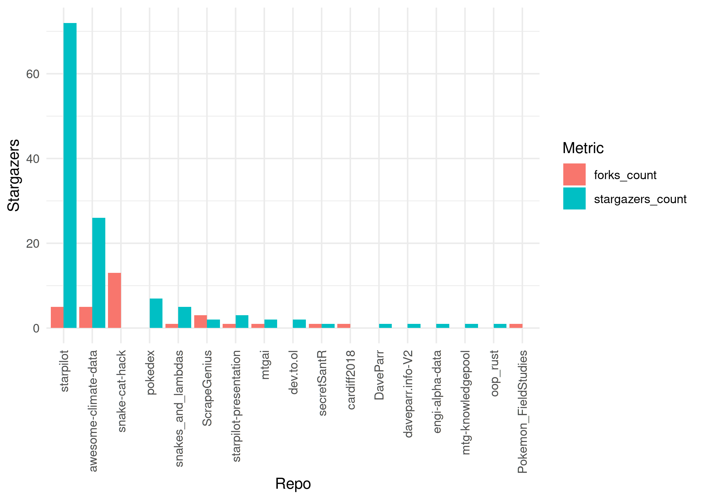

## Popular Repos

```{r}
library(gh)
library(tibble)
library(tidyr)
library(dplyr)
library(ggplot2)

repos <- tibble::tibble(
  repos = gh::gh("/users/{username}/repos",
    username = "daveparr",
    .limit = 100
  )
)

repos_to_plot <- repos %>%
  tidyr::hoist(
    repos,
    repo_name = "name",
    fork = "fork",
    forks_count = "forks_count",
    stargazers_count = "stargazers_count",
  ) %>%
  dplyr::filter(fork == FALSE) %>%
  dplyr::filter(forks_count > 0 | stargazers_count > 0) %>%
  dplyr::arrange(desc(stargazers_count)) %>%
  tidyr::pivot_longer(
    cols = ends_with("_count"),
    names_to = "metric", values_to = "count"
  ) %>%
  dplyr::arrange(desc(count))

plot <- repos_to_plot %>%
  ggplot2::ggplot(aes(
    x = forcats::fct_reorder(repo_name, count, .desc = TRUE),
    y = count,
    fill = metric
  )) +
  ggplot2::geom_col(position = "dodge") +
  ggplot2::guides(x = guide_axis(angle = 90)) +
  ggplot2::labs(
    x = "Repo",
    y = "Stargazers",
    fill = "Metric"
  ) +
  ggplot2::theme_minimal()

ggplot2::ggsave("graph.png")
```



## DaveParr.Info

I have a blog at [DaveParr.info](DaveParr.info).

## Popular Blogs

The blog is reyndicated at [Dev.to](https://dev.to/daveparr). Here are the most popular articles.

```{r}
library(dev.to.ol)
library(dplyr)
library(knitr)

dev.to.ol::get_users_articles() %>%
  dplyr::arrange(dplyr::desc(public_reactions_count)) %>%
  dplyr::slice(1:5) %>%
  dplyr::mutate(article = paste0("[", title, "](", url, ")")) %>%
  dplyr::select(
    article,
    public_reactions_count,
    comments_count,
    page_views_count
  ) %>%
  knitr::kable()
```

## About

This profile is generated by Github Actions and R Markdown.